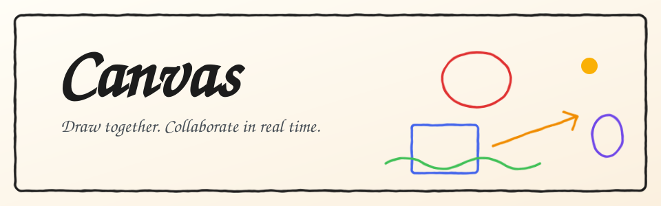
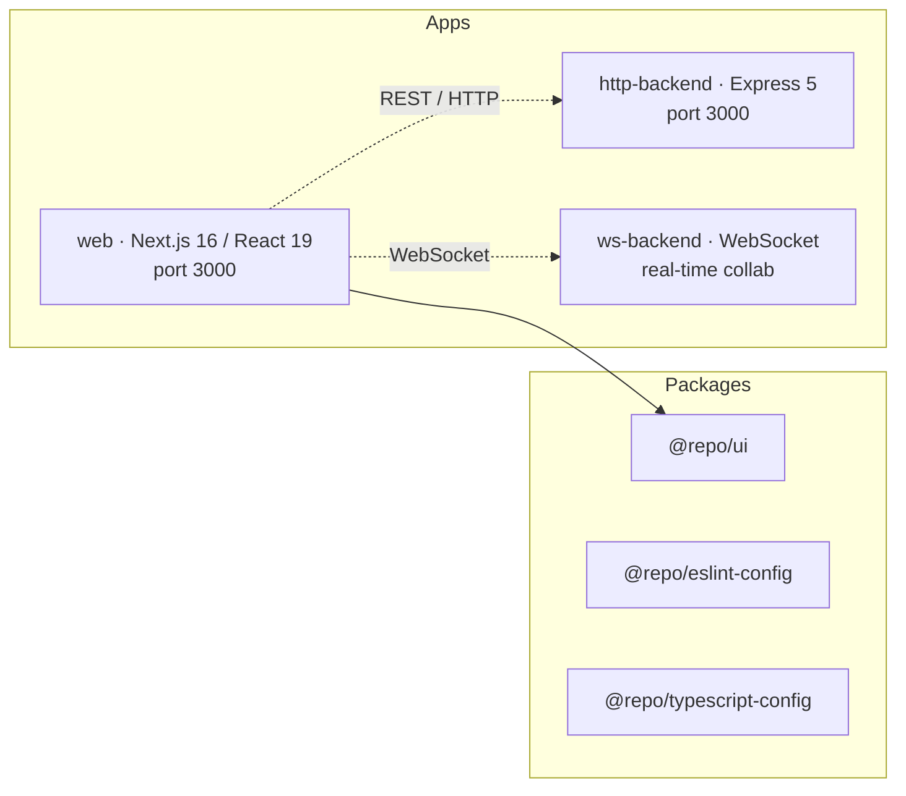

<p align="center">
  
</p>

<p align="center">
  <strong>Canvas</strong> is a real-time collaborative whiteboard — draw, sketch, and brainstorm together from anywhere. 🎨
</p>

<p align="center">
  
  
  
  
  
  
  
  
  
</p>

---

## ✨ Highlights

- 🖌️ **Draw & sketch** on an infinite canvas — an Excalidraw-inspired whiteboard experience
- 👥 **Real-time collaboration** via a dedicated WebSocket backend
- 🌐 **REST API** powered by Express for rooms, shapes & persistence
- ⚛️ **Modern frontend** built with Next.js 16 and React 19
- 🧩 **Shared packages** (`@repo/ui`, lint & TS configs) reused across every app
- 📦 **100% TypeScript** monorepo orchestrated by Turborepo + pnpm

## 🗂️ What's inside?

This monorepo includes the following apps and packages:

### 📱 Apps

- 🖥️ **`web`** — a [Next.js](https://nextjs.org/) frontend (React 19, Next.js 16) served on **port 3000**
- ⚙️ **`http-backend`** — an [Express](https://expressjs.com/) HTTP API server written in TypeScript
- 🔌 **`ws-backend`** — a WebSocket backend for real-time collaboration (Canvas-Collab)

> [!NOTE]
> Both `web` and `http-backend` currently default to **port 3000**. If you run them together, change the port of one of them (e.g. set `PORT` for `http-backend`).

### 📦 Packages

- 🎛️ **`@repo/ui`** — a shared React component library used by the web app
- 📐 **`@repo/eslint-config`** — shared ESLint configurations
- 🏗️ **`@repo/typescript-config`** — shared `tsconfig.json` files used throughout the monorepo

Each package and app is 100% [TypeScript](https://www.typescriptlang.org/).

### 🧰 Utilities

- [TypeScript](https://www.typescriptlang.org/) for static type checking
- [ESLint](https://eslint.org/) for code linting
- [Prettier](https://prettier.io) for code formatting
- [Turbo](https://turborepo.dev) for task orchestration & caching

## 🏗️ Architecture



## 📋 Requirements

- Node.js `>=24` (see `engines` in `package.json`)
- pnpm `11.25.0` (see `packageManager`)

## 🚀 Getting Started

Install dependencies from the repo root:

```sh
pnpm install
```

### 🧑‍💻 Develop

Run all apps and packages in development mode:

```sh
pnpm dev
```

Or run a specific app using a [filter](https://turborepo.dev/docs/crafting-your-repository/running-tasks#using-filters):

```sh
pnpm dev --filter=web
pnpm dev --filter=http-backend
```

### 🧱 Build

Build all apps and packages:

```sh
pnpm build
```

Build a specific app or package:

```sh
pnpm build --filter=web
pnpm build --filter=http-backend
```

### 🔍 Lint & Type Check

```sh
pnpm lint
pnpm check-types
```

### ✏️ Format

```sh
pnpm format
```

## 💾 Remote Caching

Turborepo can use [Remote Caching](https://turborepo.dev/docs/core-concepts/remote-caching) to share build caches across machines and CI/CD pipelines. By default, it caches locally. To enable Remote Caching with a Vercel account:

```sh
pnpm exec turbo login
pnpm exec turbo link
```

## 🔗 Useful Links

Learn more about the power of Turborepo:

- [Tasks](https://turborepo.dev/docs/crafting-your-repository/running-tasks)
- [Caching](https://turborepo.dev/docs/crafting-your-repository/caching)
- [Remote Caching](https://turborepo.dev/docs/core-concepts/remote-caching)
- [Filtering](https://turborepo.dev/docs/crafting-your-repository/running-tasks#using-filters)
- [Configuration Options](https://turborepo.dev/docs/reference/configuration)
- [CLI Usage](https://turborepo.dev/docs/reference/command-line-reference)

---

<p align="center">
  Made with ❤️ for collaborative creativity.
</p>
