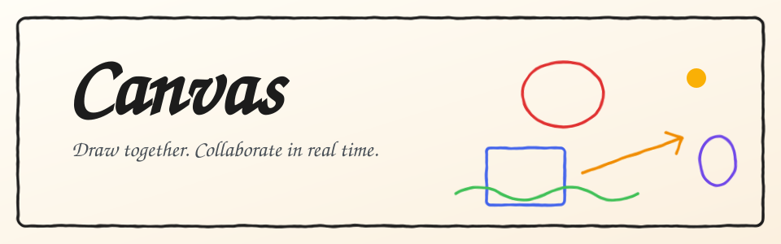
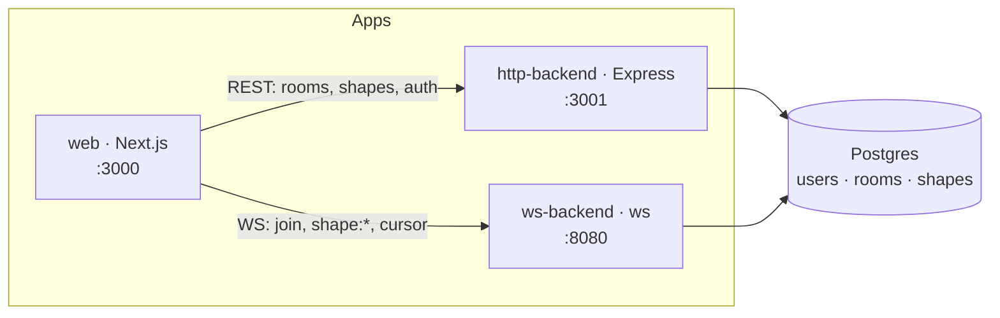

<p align="center">
  
</p>

<p align="center">
  <strong>Canvas</strong> is a real-time collaborative whiteboard — draw, sketch, and brainstorm together from anywhere. 🎨
</p>

<p align="center">
  
  
  
  
  
  
  
  
</p>

---

## 🚀 Run it

**Full step-by-step guide (install → Postgres → migrate → dev): [`HOW_TO_RUN.md`](HOW_TO_RUN.md)**

Quick version (Postgres running, `.env` files copied — see the guide):

```sh
pnpm install
pnpm --filter @repo/db migrate   # create users / rooms / shapes tables
pnpm dev                         # web :3000 · http :3001 · ws :8080
```

Then open http://localhost:3000, create a board, and share the link —
a second browser tab draws live with you.

## ✨ Highlights

- 🖌️ **7 drawing tools** on an infinite canvas (rect, ellipse, diamond, line, arrow, pencil, text) + select/move, eraser, pan & zoom
- 👥 **Real-time collaboration** — optimistic shape sync, live cursors with name flags, presence roster
- 💾 **Postgres persistence** — every shape is a row (`packages/db/schema.sql`); write-through over WS + HTTP autosave backup
- 🔗 **Share-by-link rooms** — short ids (`/room/aB3xK9mQ2Z`), no login required; optional JWT auth included
- 🧩 **Shared packages** (`@repo/shared` types+zod protocol, `@repo/db` SQL layer) reused by every app
- 📖 **Written for studying** — every file has a header comment explaining what it does and why

## 🗂️ What's inside?

### 📱 Apps

- 🖥️ **`web`** — [Next.js](https://nextjs.org/) frontend (React 19) on **port 3000**
  - `app/page.tsx` — landing (create / join board)
  - `app/room/[roomId]/page.tsx` — name gate → whiteboard
  - `components/canvas/Whiteboard.tsx` — the canvas engine (pan/zoom, drafts, selection)
  - `hooks/useCollabRoom.ts` — the **only** file that touches WebSocket
  - `lib/canvas/draw.ts` + `geometry.ts` — rendering + camera math
- ⚙️ **`http-backend`** — [Express](https://expressjs.com/) REST API on **port 3001**
  - `POST /api/rooms`, `GET /api/rooms/:id`, `GET|PUT|DELETE /api/rooms/:id/shapes`
  - `POST /api/auth/signup|signin` (optional JWT — guests can draw without it)
- 🔌 **`ws-backend`** — realtime server (`ws` lib) on **port 8080**
  - `rooms/RoomManager.ts` — in-memory room cache + broadcast + DB write-through

### 📦 Packages

- 🔷 **`@repo/shared`** — `Shape` types, WS message protocol, zod validators, constants
- 🐘 **`@repo/db`** — `pg` Pool singleton, room/shape/user queries, `schema.sql` + `migrate`
- 🎛️ **`@repo/ui`** — shared React component library (template default)
- 📐 **`@repo/eslint-config`** / 🏗️ **`@repo/typescript-config`** — shared configs

Each app/package is 100% [TypeScript](https://www.typescriptlang.org/).

## 🏗️ Architecture


```mermaid
flowchart LR
    subgraph Apps["Apps"]
        Web["web · Next.js<br/>:3000"]
        Http["http-backend · Express<br/>:3001"]
        Ws["ws-backend · ws<br/>:8080"]
    end

    DB[("Postgres<br/>users · rooms · shapes")]

    Web -- "REST: rooms, shapes, auth" --> Http
    Web -- "WS: join, shape:*, cursor" --> Ws
    Http --> DB
    Ws --> DB
```

Study order: `packages/shared` → `packages/db/schema.sql` → `http-backend`
→ `ws-backend/rooms/RoomManager.ts` → `web/hooks/useCollabRoom.ts` →
`web/components/canvas/Whiteboard.tsx`.

## 📋 Requirements

- Node.js `>=20` (24 recommended)
- pnpm `9` or `11`
- Postgres `14+` (local install or `docker compose up -d`)

## 🧰 Commands

```sh
pnpm dev            # all apps in dev mode (turbo)
pnpm build          # build everything
pnpm lint           # eslint everywhere
pnpm check-types    # tsc --noEmit everywhere
pnpm format         # prettier
pnpm db:migrate     # apply packages/db/schema.sql
```

## 💾 Remote Caching

Turborepo can use [Remote Caching](https://turborepo.dev/docs/core-concepts/remote-caching) to share build caches across machines and CI/CD pipelines. By default, it caches locally. To enable Remote Caching with a Vercel account:

```sh
pnpm exec turbo login
pnpm exec turbo link
```

---

<p align="center">
  Made with ❤️ for collaborative creativity.
</p>
